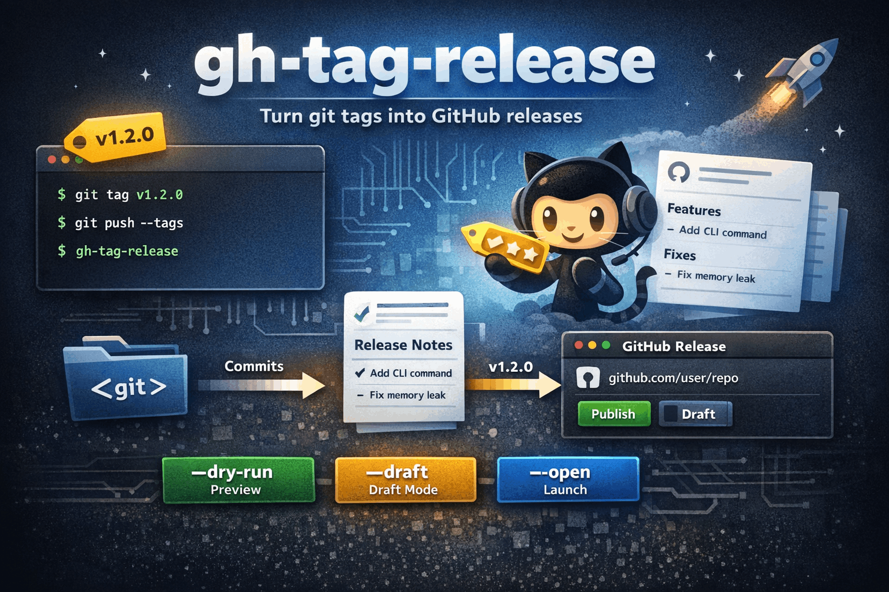

# gh-tag-release

A fast CLI for turning git tags into GitHub releases with generated release notes and zero CI setup.

## Features

- **Zero-config release flow** - tag, push, run the CLI.
- **Automatic tag detection** - uses the newest git tag by default.
- **Manual tag selection** - publish a specific tag with `--tag`.
- **Commit-based release notes** - groups conventional commits into readable sections.
- **GitHub CLI support** - uses `gh release create` when `gh` is installed and authenticated.
- **GitHub API fallback** - publishes through `GITHUB_TOKEN` when `gh` is unavailable.
- **Draft releases** - create unpublished releases with `--draft`.
- **Dry-run preview** - inspect the title, URL, commit range, and notes before publishing.
- **Open after publish** - launch the release page in your browser with `--open`.
- **TypeScript CLI** - strict TypeScript, Commander.js, Vitest, and tsup.

## Install

```bash
pnpm add -g gh-tag-release
```

Or run without installing:

```bash
npx gh-tag-release
```

**Requirements:** Node.js >= 20

## Quick Start

```bash
# Create and push a tag
git tag v1.2.0
git push --tags

# Publish the latest tag as a GitHub release
gh-tag-release

# Preview the release without publishing
gh-tag-release --dry-run

# Publish a draft release for a specific tag
gh-tag-release --tag v1.2.0 --draft
```

## CLI Reference

```text
Usage: gh-tag-release [options]

Turn git tags into GitHub releases instantly.

Options:
  --draft          create a draft release
  --tag <tag>      create a release for a specific tag
  --latest         use the latest tag in the repository
  --dry-run        preview the release without publishing it
  --open           open the release page after publishing
  -v, --version    output the version number
  -h, --help       display help for command
```

## Example Output

### Dry Run

```text
Repository: openai/gh-tag-release
Detected tag: v0.0.2

Commits since v0.0.1

- fix: patch release

Dry run

Title: v0.0.2
URL: https://github.com/openai/gh-tag-release/releases/tag/v0.0.2

Fixes

- patch release (d134a7d)
```

### Published Release

```text
Repository: user/project
Detected tag: v1.2.0

Commits since v1.1.0

- feat: add CLI command
- fix: memory leak
- docs: update README

https://github.com/user/project/releases/tag/v1.2.0
```

## Authentication

If GitHub CLI is installed and authenticated, `gh-tag-release` will use it automatically:

```bash
gh auth login
gh-tag-release
```

Otherwise provide a GitHub token:

```bash
export GITHUB_TOKEN=your_token
gh-tag-release
```

**Required scope:** `repo`

## Release Notes

Release notes are generated from commit messages and grouped into sections.

| Commit Type | Section       |
| ----------- | ------------- |
| `feat`      | Features      |
| `fix`       | Fixes         |
| `docs`      | Documentation |
| `chore`     | Misc          |
| `refactor`  | Refactors     |
| `perf`      | Performance   |
| `test`      | Tests         |
| other       | Other         |

Example:

```text
Features

- add CLI command (a1b2c3d)

Fixes

- resolve crash (d4e5f6g)
```

## How It Works

```text
gh-tag-release
      │
      ▼
1. Read git remote origin
   infer owner/repo from GitHub remote URL
      │
      ▼
2. Resolve target tag
   --tag <tag> or latest tag in the repository
      │
      ▼
3. Collect commits
   previousTag..targetTag
      │
      ▼
4. Build release notes
   group conventional commits into sections
      │
      ▼
5. Publish release
   gh CLI if authenticated
   otherwise GitHub Releases API via GITHUB_TOKEN
      │
      ▼
6. Optional browser open
```

## Module Structure

```text
src/
├── commands/   CLI command entrypoint
├── lib/        git, GitHub, notes, banner, browser, errors
└── index.ts    Commander bootstrap
```

## Dev

```bash
pnpm install
pnpm dev --dry-run
pnpm test
pnpm build
```

## Contributing

1. Fork the repo
2. Create a branch: `git checkout -b feat/my-change`
3. Add or update tests
4. Run `pnpm test && pnpm build`
5. Open a pull request

## Environment Variables

| Variable       | Description                                                          |
| -------------- | -------------------------------------------------------------------- |
| `GITHUB_TOKEN` | GitHub personal access token used when `gh` CLI auth is unavailable. |

## Stack

- TypeScript
- Commander.js
- ora
- picocolors
- Vitest
- tsup
- pnpm

## License

Apache-2.0 © [Ashar Irfan](https://x.com/MrAsharIrfan) built with [Command Code](https://commandcode.ai).
